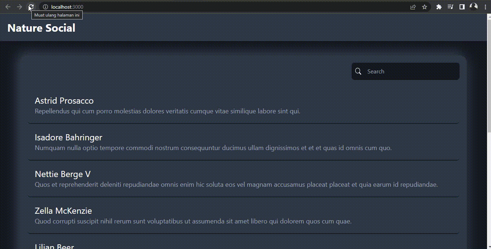
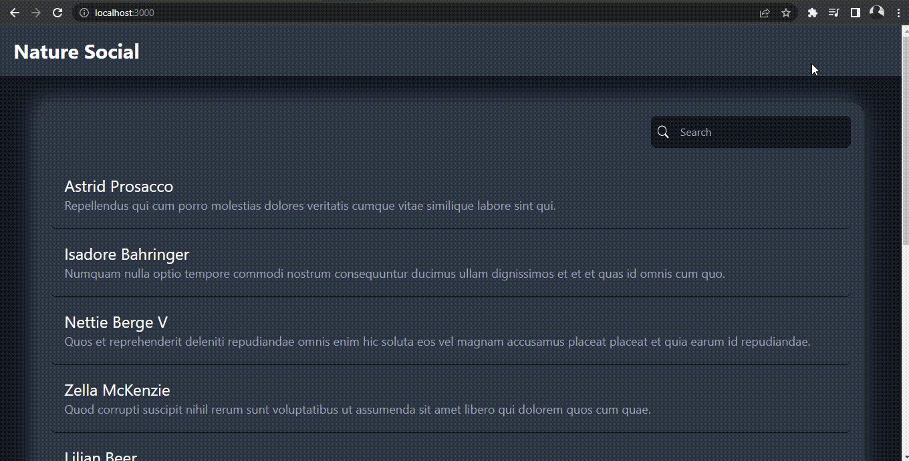

# frontend-redcomm

## Build Setup

```bash
# install dependencies
$ npm install

# serve with hot reload at localhost:3000
$ npm run dev

# build for production and launch server
$ npm run build
$ npm run start

# generate static project
$ npm run generate
```

### Result -- Demo Program

1. Load Data
   

2. Load More
   

3. Search Data
   

4. Responsive UI
   
